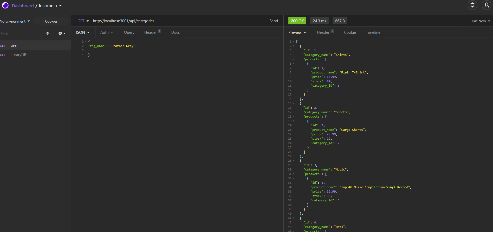
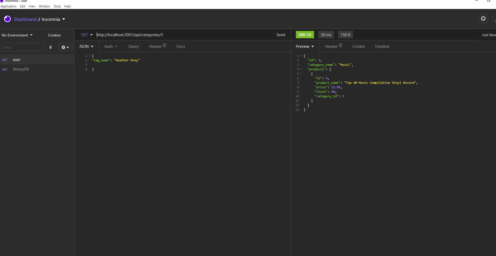

# Ecommerce Back-end

## Description 
The following files contain the necessary assets to deploy a functional random password generator. Using HTML, CSS, and JavaScript, the site allows users to choose a password length between 8 and 128 characters and select whether or not they'd like the password to include uppercase, lowercase, numbers, and/or special characters. 

## Table of Contents

* [Installation](#installation)
* [Features](#features)
* [Screenshots](#screenshots)

## Installation

To use these files follow these steps: 
    1. Fork this repo 
    2. Create a local clone of your fork 
From here you want to create you database, update your .env file, run npm i, then npm start. Using a tool like insomnia, you are able to get, post, put, and delete data in your database. 

Check out this video on how to use this application:

## Features

This site features usage of Node.js, Javascript, express, and sequelize. This applications handles the Model and Controller piece of the MVC structure. There is no front end currently developed for this application. 

# Screenshots

